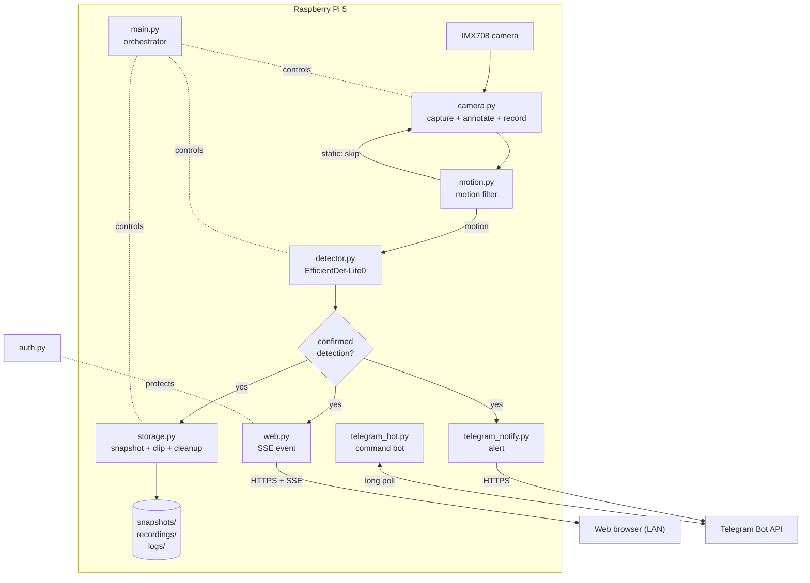
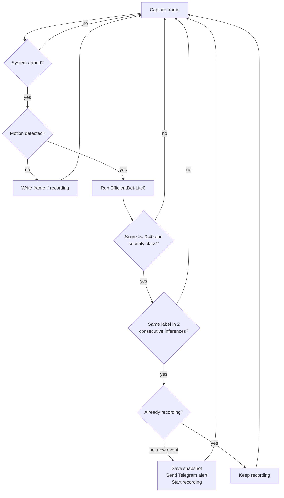
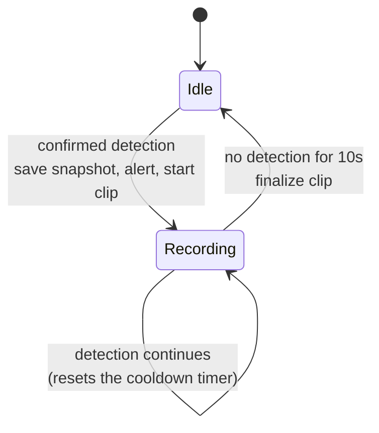
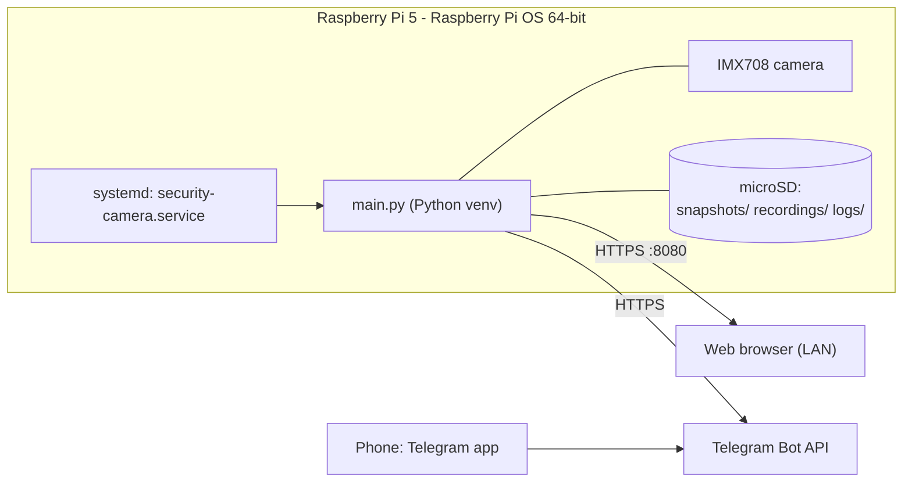

# Intelligent Edge-AI Security Camera — Technical Report

**Author:** Nikoloz Oniani
**Institution:** Caucasus University
**Year:** 2026
**Repository:** https://github.com/onianinikoloz1643-blip/security-camera-pi

> This file is the source for the written technical report. Diagrams are written in
> Mermaid — GitHub renders them inline, and they can be exported to images for a Word/PDF
> version. Places that need a screenshot from the running system are marked
> `[SCREENSHOT: ...]`.

---

## 1. Abstract

This project is a security camera that detects people and vehicles in real time and runs
entirely on a Raspberry Pi 5. There is no cloud component: capture, detection, recording,
notification, and the web interface all run on the device. When the camera detects a person
or vehicle, it saves an annotated snapshot, records a video clip for the duration of the
event, updates a live web dashboard, and sends a Telegram alert with a photo. The detector
is a quantized TensorFlow Lite model (EfficientDet-Lite0 INT8) preceded by a lightweight
motion filter that keeps the CPU idle when nothing is moving. On the Pi 5 the model runs at
roughly 23 frames per second while the device stays well under its thermal limit.

## 2. Introduction

### 2.1 Problem

Most consumer security cameras depend on a cloud service: footage and detections are sent to
a vendor's servers, features sit behind a subscription, and the user has little control over
where their video goes. The goal of this project was to build a camera that does the same
core job — detect people and vehicles and alert the owner — without any of that, by doing all
processing locally on affordable single-board hardware.

### 2.2 Goals

- Detect people and vehicles in a live camera feed in real time.
- Run every part of the system on the device, with no cloud dependency.
- Record the relevant footage and notify the user when something is detected.
- Provide a usable interface (a web dashboard and a Telegram bot) to review activity and
  control the system.
- Stay stable enough to run unattended as a background service.

### 2.3 Scope

The system detects the COCO classes relevant to security — person, car, motorcycle, bus,
truck, bicycle — using a pre-trained model. Training a custom model was out of scope; the
focus is on building a complete, working edge system around an existing detector. Face
recognition, license-plate reading, and multi-camera support are not included.

## 3. Requirements

### 3.1 Functional

| ID | Requirement |
|----|-------------|
| F1 | Capture a live video feed from the camera. |
| F2 | Detect people and vehicles in each frame. |
| F3 | Skip detection on static scenes to save CPU. |
| F4 | Save a snapshot and record a clip when something is detected. |
| F5 | Show recent activity in a web dashboard with live updates. |
| F6 | Send a Telegram alert with a photo on detection. |
| F7 | Let the user query and control the system from Telegram. |
| F8 | Protect the web interface with authentication over HTTPS. |
| F9 | Manage disk space automatically. |
| F10 | Start on boot and recover from crashes. |

### 3.2 Non-functional

| ID | Requirement |
|----|-------------|
| N1 | Real-time detection (inference fast enough to keep up with the capture rate). |
| N2 | Run within the Pi's thermal and power limits during continuous operation. |
| N3 | No cloud services; all data stays on the device. |
| N4 | Credentials and secrets must not be stored in the source repository. |
| N5 | Recover cleanly from camera errors and restart automatically. |

## 4. System Architecture and Design

### 4.1 High-level architecture

The system is a single Python application (`main.py`) that orchestrates a set of focused
modules, plus a Flask web server that runs in a background thread. Each module has one
responsibility.



### 4.2 Modules

| Module | Responsibility |
|--------|----------------|
| `main.py` | Startup, configuration validation, the capture/detect/store loop, graceful shutdown. |
| `config.py` | All tunable parameters and a `validate_config()` check that runs before anything starts. |
| `camera.py` | Picamera2 capture, frame annotation, and video recording (with orientation correction). |
| `motion.py` | Pixel-difference motion detector used as a pre-filter before inference. |
| `detector.py` | TensorFlow Lite inference and the consecutive-frame confirmation filter. |
| `storage.py` | Snapshots, recordings, disk cleanup, and logging setup. |
| `auth.py` | HTTP basic auth: hashed credentials, password-strength rules. |
| `web.py` | Flask HTTPS dashboard with Server-Sent Events and a JSON API. |
| `telegram_notify.py` | Outgoing detection alerts with cooldowns. |
| `telegram_bot.py` | Interactive command bot. |

### 4.3 Detection pipeline

The core loop runs once per captured frame. The motion filter and the confidence/confirmation
checks each act as a gate, so the expensive neural-network inference only runs when it is
worth running, and only confident, repeated detections trigger an event.



### 4.4 Event and recording lifecycle

An "event" is one continuous appearance. The system saves a single snapshot at the start of
an event and records one clip that runs until detections stop for a cooldown period. This
replaces an earlier design that saved an image every few seconds, which produced large piles
of near-identical snapshots.



### 4.5 Sequence of a detection event

```mermaid
sequenceDiagram
    participant Loop as main loop
    participant Cam as camera.py
    participant Mot as motion.py
    participant Det as detector.py
    participant Sto as storage.py
    participant Web as web.py (SSE)
    participant Tg as Telegram
    Loop->>Cam: capture_frame()
    Cam-->>Loop: frame
    Loop->>Mot: detect(frame)
    Mot-->>Loop: motion = true
    Loop->>Det: detect(frame)
    Det-->>Loop: [person 0.62]
    Note over Loop: first detection of a new event
    Loop->>Sto: save_snapshot(annotated)
    Loop->>Web: push_event("snapshot")
    Loop->>Tg: send_detection(photo)
    Loop->>Sto: start_recording()
    Loop->>Web: push_event("recording_start")
```

### 4.6 Deployment



## 5. Implementation

### 5.1 Capture (`camera.py`)

Frames are captured with Picamera2 at 1280×720. The camera configuration applies a horizontal
and vertical flip through a libcamera `Transform`, controlled by `CAMERA_HFLIP` / `CAMERA_VFLIP`
in the configuration, because the camera is physically mounted upside-down. Correcting the
orientation in the pipeline matters for accuracy as well as presentation: the detector was
trained on upright people, so an inverted frame lowers its confidence.

### 5.2 Motion filter (`motion.py`)

Before any inference, the current frame is converted to grayscale, blurred, and compared to
the previous frame with an absolute difference. The difference is thresholded, dilated, and
its contours are measured; if the moving area is large enough the frame is treated as having
motion. If there is no motion, the frame never reaches the detector. The previous-frame buffer
resets after 30 seconds of stillness so that a slow lighting change does not register as a
false trigger. In benchmarking the filter takes about 5 ms per frame, far cheaper than the
~43 ms of an inference.

### 5.3 Detection (`detector.py`)

The detector loads EfficientDet-Lite0 quantized to INT8 and runs it with the LiteRT
(`ai-edge-litert`) runtime. The model outputs bounding boxes, class indices, scores, and a
count. The detector keeps only the security-relevant classes (person, car, motorcycle, bus,
truck, bicycle) that score at or above the threshold (0.40).

On top of the threshold there is a confirmation filter: a label must appear in two consecutive
inferences before it is reported. This removes one-frame false positives at the cost of a
small delay. A diagnostic mode (`DETECTION_DEBUG`) can log the raw scores the model produces
before the threshold and the filter, which was used during tuning to understand misses; it is
off by default.

### 5.4 Event handling and storage (`main.py`, `storage.py`)

When a detection is confirmed and no recording is in progress, the loop saves one annotated
snapshot, sends a Telegram alert, and starts recording. Recording continues until there have
been no detections for `RECORDING_COOLDOWN` seconds (default 10), then the clip is finalized.
Long events are split into separate files every five minutes.

Snapshots are JPEG; recordings are AVI written with OpenCV's `VideoWriter`. Each snapshot and
clip share a timestamp, which the web interface uses to pair a clip with its snapshot as a
thumbnail. When disk usage passes 90%, the oldest snapshots and recordings are deleted until
usage drops below 85%; a file currently being recorded is never deleted.

### 5.5 Web interface (`web.py`, `auth.py`)

The dashboard is a Flask application served over HTTPS using a self-signed certificate. Every
route requires HTTP basic auth. Credentials are stored in `auth.txt` as a username and a
SHA-256 hash; on first run a strong random password is generated, printed once to the console,
and the file is created with `0600` permissions. Passwords are compared in constant time, and
a password-strength policy is enforced when the password is changed.

The page receives live updates through Server-Sent Events: when the loop detects something,
saves a snapshot, or starts/stops a recording, it pushes an event that the browser handles
without reloading. Snapshots open in a full-screen viewer that supports scroll-to-zoom and
drag-to-pan. The recordings list is rendered from the JSON API and refreshes whenever a clip
starts or stops.

### 5.6 Telegram (`telegram_notify.py`, `telegram_bot.py`)

`telegram_notify.py` sends detection alerts with a photo, subject to a global cooldown and a
per-label cooldown so a single event does not flood the chat. `telegram_bot.py` runs a
long-polling loop in a background thread and answers commands (see §7). Commands are accepted
only from the configured chat ID. The bot token and chat ID are read from environment
variables, so no secret is ever committed to the repository.

### 5.7 Configuration and validation (`config.py`)

All parameters live in `config.py`. `validate_config()` runs at startup and refuses to start
if anything is invalid — for example a threshold outside 0–1, a missing model file, or a
missing SSL certificate — which turns silent runtime failures into a clear message at launch.

### 5.8 Reliability

The application is run by a systemd service with `Restart=always`, so it returns after a
crash or a reboot. Logging uses a rotating file handler (5 MB × 3 files) plus the console, so
logs cannot fill the disk. On shutdown the camera is released and any in-progress recording is
finalized.

## 6. Threading model

The process runs two main threads. The main thread owns the capture/detect/store loop. A
daemon thread runs the Flask server. When the Telegram bot is enabled, a third daemon thread
long-polls the Telegram API for commands. Shared state between threads is small: the web
server reads the storage directories on request, and Server-Sent Events are delivered through
per-client queues guarded by a lock.

## 7. API documentation

### 7.1 HTTP endpoints

All endpoints require HTTP basic auth and are served over HTTPS on port 8080.

| Method | Path | Description | Response |
|--------|------|-------------|----------|
| GET | `/` | Dashboard HTML. | `text/html` |
| GET | `/stream` | Server-Sent Events stream of live events. | `text/event-stream` |
| GET | `/api/status` | System statistics. | JSON |
| GET | `/api/recordings` | Recordings with paired snapshot thumbnails. | JSON |
| GET | `/snapshots/<filename>` | Serve a snapshot image. | `image/jpeg` |
| GET | `/recordings/<filename>` | Serve / download a recording. | `video/x-msvideo` |

`GET /api/status` returns:

```json
{
  "snapshots": 12,
  "recordings": 4,
  "disk_used_gb": 13.4,
  "disk_total_gb": 56.5,
  "disk_percent": 23.7
}
```

`GET /api/recordings` returns a list, newest first:

```json
[
  { "file": "20260615_210101_recording.avi", "thumb": "20260615_210101_person.jpg" }
]
```

### 7.2 Server-Sent Events

The `/stream` endpoint emits these event types:

| Event | Data | Meaning |
|-------|------|---------|
| `detection` | `{ "labels": ["person"] }` | A frame was confirmed as containing the listed classes. |
| `snapshot` | `{ "filename": "...", "total": N }` | A new snapshot was saved. |
| `recording_start` | `{}` | A recording started. |
| `recording_stop` | `{ "total": N }` | A recording finished. |
| `disk` | `{ "percent": 23.7 }` | Periodic disk-usage update. |

### 7.3 Telegram bot commands

| Command | Action |
|---------|--------|
| `/status` | Uptime, snapshot/recording counts, disk usage, recording state. |
| `/snapshot` | Send the most recent snapshot. |
| `/video` | Send the most recent finished recording (under Telegram's 50 MB limit). |
| `/disk` | Disk usage. |
| `/stop` | Pause detection. |
| `/start` | Resume detection. |
| `/password <new>` | Change the web password (strength-checked). |
| `/help` | List commands. |

## 8. Installation and configuration

Tested on Raspberry Pi OS 64-bit (Bookworm) on a Raspberry Pi 5.

1. **Clone** into `~/security_camera` and create a virtual environment with
   `--system-site-packages` (so the system Picamera2 and OpenCV are available).
2. **Install** `python3-picamera2` and `python3-opencv` with apt, and `ai-edge-litert`,
   `flask`, `numpy`, `requests` with pip.
3. **Download** the model to `models/detect.tflite`
   (`efficientdet_lite0_uint8.tflite` from the MediaPipe model storage).
4. **Enable the camera** in `/boot/firmware/config.txt`
   (`camera_auto_detect=0`, `dtoverlay=imx708`).
5. **Generate** a self-signed certificate into `ssl/cert.pem` and `ssl/key.pem`.
6. **Run** `python main.py`; note the generated admin password printed on first run.
7. **(Optional) Telegram:** export `TELEGRAM_ENABLED`, `TELEGRAM_BOT_TOKEN`,
   `TELEGRAM_CHAT_ID`, or set them in the systemd service.

The full command-by-command guide is in the repository `README.md`. Configuration parameters
(`DETECTION_THRESHOLD`, `CONSECUTIVE_FRAMES_REQUIRED`, `RECORDING_COOLDOWN`,
`STORAGE_MAX_PERCENT`, `FPS`, camera flips, cooldowns) are documented in `config.py` and the
README.

## 9. User manual

### 9.1 First run

After installation, start the service and open `https://raspberrypi.local:8080` in a browser
on the same network. Accept the self-signed-certificate warning and log in with `admin` and
the password printed on first run.

`[SCREENSHOT: login prompt]`

### 9.2 The dashboard

The top bar shows whether the system is running, the snapshot and recording counts, and disk
usage. Below it are the most recent snapshots, then the recordings, each with a thumbnail and
timestamp.

`[SCREENSHOT: full dashboard with a few detections]`

### 9.3 Use case — review a detection

1. A person enters the camera's view.
2. A toast notification appears on the dashboard and a new snapshot is added at the top, live.
3. A recording card appears in the recordings section.
4. Click the snapshot to open it full-screen; scroll to zoom in and drag to inspect.

`[SCREENSHOT: snapshot open in the zoom viewer]`

### 9.4 Use case — Telegram alert and control

1. On detection, the bot sends a photo with the detected labels and confidence.
2. Send `/status` to get uptime, counts, disk, and recording state.
3. Send `/snapshot` to pull the latest image on demand.
4. Send `/stop` to pause detection (for example when you are home) and `/start` to resume.

`[SCREENSHOT: Telegram chat showing an alert and the /status reply]`

### 9.5 Use case — verify the installation

Run `verify_install.py` to check dependencies, files, the model, the certificate, the camera,
and the service in one pass.

`[SCREENSHOT: verify_install.py output showing 36/36 passed]`

## 10. Testing and verification

- **Install verification:** `verify_install.py` runs a 36-point check across the environment,
  files, model, SSL, configuration, camera, and service. On the target Pi it passes 36/36.
- **Hardware-free testing:** `test_system.py` runs the full pipeline against `mock_camera.py`,
  which feeds a still image instead of the live camera, so the web interface and detection
  logic can be exercised without the Pi.
- **Startup validation:** `validate_config()` rejects an invalid configuration before the
  system starts.
- **Manual end-to-end testing:** detection, recording, the web dashboard, and every Telegram
  command were tested on the device.

## 11. Performance evaluation

Measured on the Raspberry Pi 5 with `benchmark.py` (100 inference frames, 200 motion frames):

| Metric | Result |
|--------|--------|
| Inference latency (mean) | 42.7 ms (min 42.2, max 49.3, σ 0.9) |
| Inference throughput | 23.4 FPS |
| Motion filter latency | 5.3 ms (~190 FPS) |
| CPU temperature under load | 58.7 °C |
| RAM | 588 MB / 8 GB |
| CPU during benchmark | ~14% |

**Analysis.** The capture loop is capped at 10 FPS, so the ~23 FPS inference ceiling gives
roughly 2.3× headroom — the detector comfortably keeps up with the feed. The motion filter is
about eight times cheaper than an inference, so on a static scene (the common case for a fixed
camera) most of the per-frame cost disappears. The very low standard deviation (0.9 ms) shows
the inference time is stable rather than occasionally spiking. At 58.7 °C the Pi runs well
below its ~80 °C throttle point, so sustained operation does not throttle the CPU.

## 12. Limitations and future work

- **Small detection model.** EfficientDet-Lite0 was chosen for speed. It detects people and
  vehicles reliably at close to medium range in reasonable light, but its confidence drops
  below the threshold for distant or poorly-lit subjects. The threshold is deliberately not
  lowered to compensate, because that would admit false positives and raise the sustained CPU
  and thermal load. A larger model or a Hailo/Coral accelerator would extend the usable range.
- **Recordings are AVI.** They download rather than play in the browser. Transcoding to MP4
  would allow in-browser playback.
- **Single camera, local network.** The dashboard is intended for the local network behind a
  self-signed certificate, not exposure to the public internet.

## 13. Conclusion

The project meets its goals: a Raspberry Pi 5 with a camera detects people and vehicles in
real time, records and reports events, and is controlled through a web dashboard and a
Telegram bot — entirely on-device, with no cloud service. The motion pre-filter and a small
quantized model keep it fast and cool enough to run continuously as a background service, and
the measured performance leaves comfortable headroom over the capture rate.

## Appendix A — Repository

- Source code: https://github.com/onianinikoloz1643-blip/security-camera-pi
- Project layout, configuration reference, and the command-by-command install guide are in
  `README.md`.
